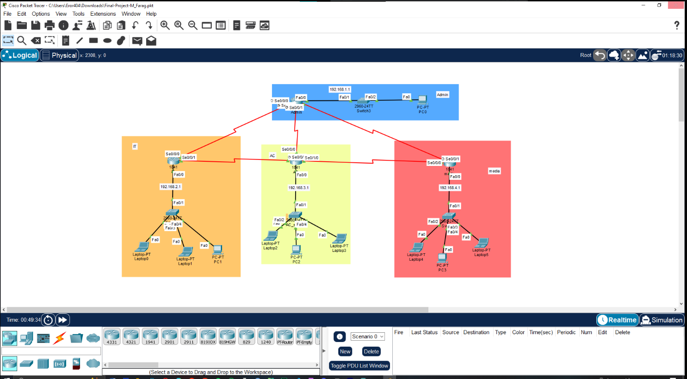

This is my final project for the **Mini-Course by Pixels Egypt** during the mid-year break 2025.  
The objective was to design and configure a functional, secure, and efficient network for multiple committees in Pixels Egypt’s workspace.

## Project Highlights
- **Subnetting** for optimal IP allocation.
- **VLAN Configuration** for segmentation.
- **Dynamic Routing (RIP & OSPF)**.
- **DHCP Setup** for automatic IP assignment.
- **Secure Telnet Access** for remote management.

## Tools Used
- Cisco Packet Tracer
- Networking Fundamentals
- Routing & Switching Configuration

## Network Topology
**.
- **DHCP Setup** for automatic IP assignment.
- **Secure Telnet Access** for remote management.

## Tools Used
- Cisco Packet Tracer
- Networking Fundamentals
- Routing & Switching Configuration

## Network Topology

## Files
- [`Project.pkt`](Files/Final-Project-.pkt) → Packet Tracer network topology file.  
- [`Documentation.pdf`](Files/Final-Project-Document.pdf) → Step-by-step project documentation.  

## Video Simulation
🎥 [Watch on Google Drive](https://drive.google.com/file/d/1-jSecWljj0HqH9_5lAGbKDPRvhhHsbQa/view?usp=sharing)

---

© 2025 Mohamed Farag

